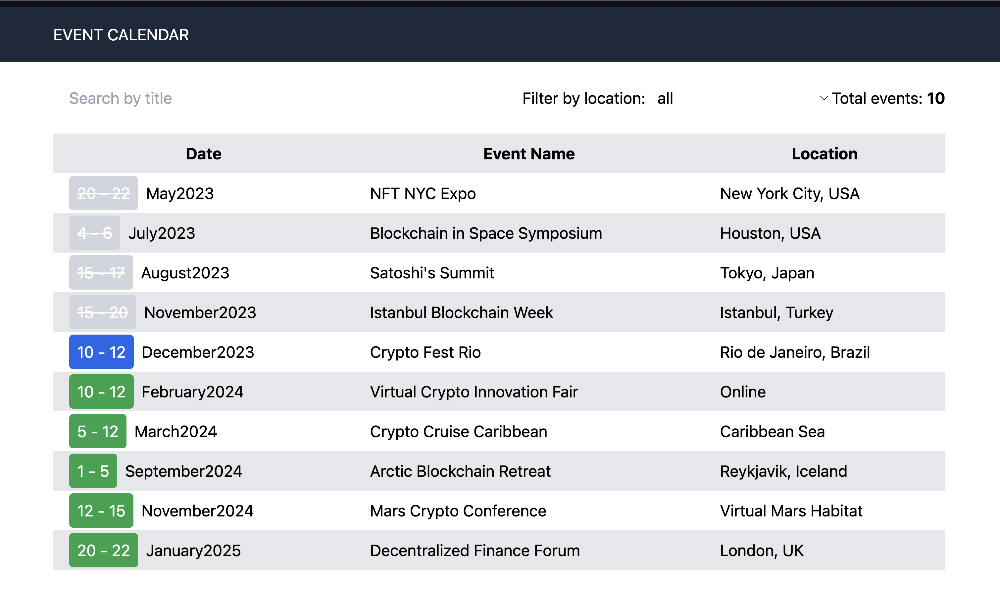

# Events calendar app [ссылка](https://e-calendar.netlify.app/)

## Установка и запуск проекта

Для того, чтобы запустить данный проект локально необходимо скачать архив проекта или же склонировать репозиторий командой `git clone <link>`

После чего в папке с проектом необходимо установить зависимости "yarn", если вы используете yarn или "npm install", если пользуетесь npm менеджером

## О проекте

- Проект является текстовым заданием на позицию Front-end разработчика
   - Ссылка на описание тестового задания [здесь](https://terms-burn-uda.craft.me/f4Z2VTzWxELWN9)
- Приложение отображает список событий, полученных с сервера, от завершённых к грядущим
   - Светло-серым обозначаются завершённые мероприятия
   - Синим: мероприятия текущего месяца
   - Зелёным: мероприятия, следующих месяцев 
- Присутствует поиск по названию события
- Имеется фильтр по локации
- По нажатию на событие открывается модальное окно с подобной информацией о событии
 - Модальное окно закрывается клавишей "Escape"
 - Перемещаясь внутри модалки кнопкой "Tab" фокус не выпрыгивает за пределы 

## Технологии

- React
— TypeScript
— Zustand (в качестве стейт-менеджера)
- Ky (Для выполнения запросов)
- Tailwindcss (Для быстрого написания стилей)
- react-router-dom (для навигации)
- В качестве сборщика используется "Vite"

## Контакты

[Telegram](https://t.me/k0lchanov)